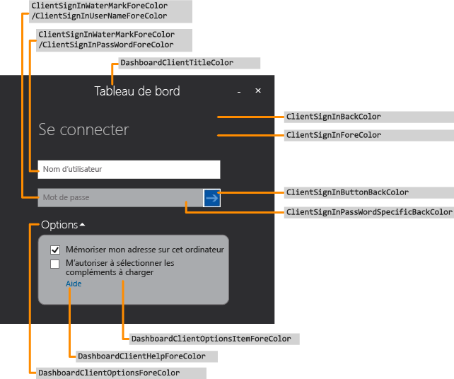
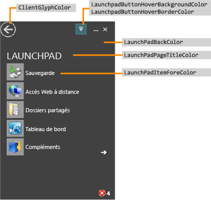
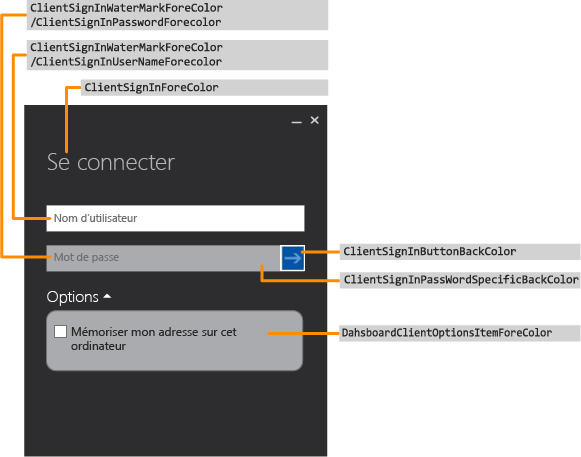
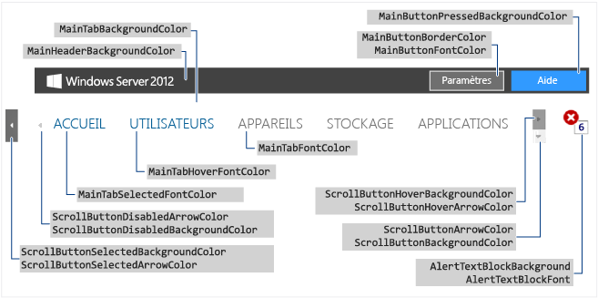
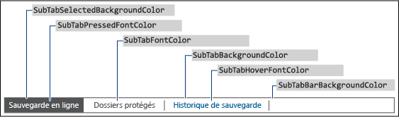
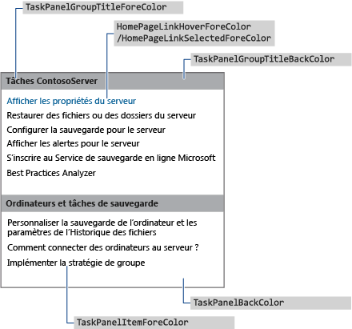
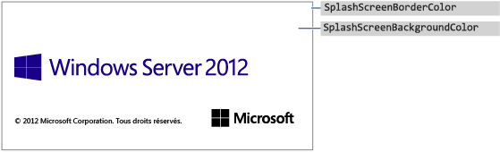
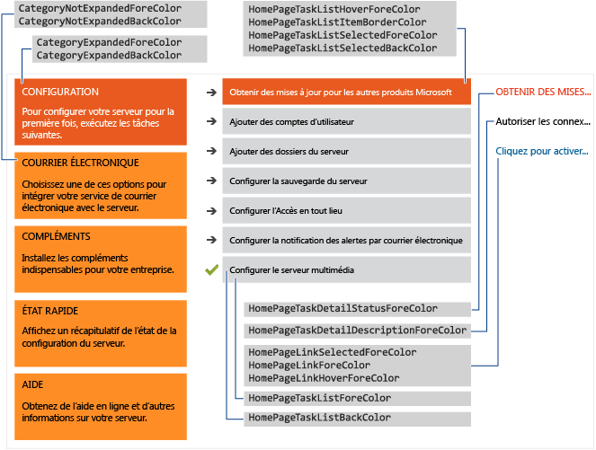

# <a name="change-the-color-scheme-of-the-dashboard-and-launchpad"></a>Modification du modèle de couleurs du tableau de bord et de la zone de lancement

>S'applique à : Windows Server 2016 Essentials, Windows Server 2012 R2 Essentials, Windows Server 2012 Essentials

Vous pouvez modifier le modèle de couleurs du tableau de bord et de la zone de lancement en définissant les couleurs que vous voulez utiliser dans un fichier au format XML que vous allez ensuite placer dans un dossier sur le serveur et dont vous allez spécifier le nom dans une entrée de Registre.  
  
## <a name="create-the-xml-file"></a>Création du fichier XML  
 L’exemple suivant illustre le contenu possible du fichier .xml :  
  
```xml  
<DashboardTheme xmlns="https://www.microsoft.com/HSBS/Dashboard/Branding/2010">  
  
  <!-- Hex color values overwriting default SKU theme colors -->  
  
    <SplashScreenBackgroundColor HexValue="FFFFFFFF"/>  
    <SplashScreenBorderColor HexValue="FF000000"/>  
    <MainHeaderBackgroundColor HexValue="FF414141"/>  
    <MainTabBackgroundColor HexValue="FFFFFFFF"/>  
    <MainTabFontColor HexValue="FF999999"/>  
    <MainTabHoverFontColor HexValue="FF0072BC"/>  
    <MainTabSelectedFontColor HexValue="FF0072BC"/>  
    <MainButtonPressedBackgroundColor HexValue="FF0072BC"/>  
    <MainButtonFontColor HexValue="FFFFFFFF"/>  
    <MainButtonBorderColor HexValue="FF6E6E6E"/>  
    <ScrollButtonBackgroundColor HexValue="FFF0F0F0"/>  
    <ScrollButtonArrowColor HexValue="FF999999"/>  
    <ScrollButtonHoverBackgroundColor HexValue="FF999999"/>  
    <ScrollButtonHoverArrowColor HexValue="FF6E6E6E"/>  
    <ScrollButtonSelectedBackgroundColor HexValue="FF6E6E6E"/>  
    <ScrollButtonSelectedArrowColor HexValue="FFFFFFFF"/>  
    <ScrollButtonDisabledBackgroundColor HexValue="FFF8F8F8"/>  
    <ScrollButtonDisabledArrowColor HexValue="FFCCCCCC"/>  
    <AlertTextBlockBackground HexValue="FFFFFFFF"/>  
    <AlertTextBlockFont HexValue="FF000000"/>  
    <FontColor HexValue="FF000000"/>  
    <SubTabBarBackgroundColor HexValue="FFFFFFFF"/>  
    <SubTabBackgroundColor HexValue="FFFFFFFF"/>  
    <SubTabSelectedBackgroundColor HexValue="FF414141"/>  
    <SubTabBorderColor HexValue="FF787878"/>  
    <SubTabFontColor HexValue="FF787878"/>  
    <SubTabHoverFontColor HexValue="FF0072BC"/>  
    <SubTabPressedFontColor HexValue="FFFFFFFF"/>  
    <ListViewColor HexValue="FFFFFFFF"/>  
    <PageBorderColor HexValue="FF999999"/>      
    <LaunchpadButtonHoverBorderColor HexValue="FF6BA0B4"/>  
    <LaunchpadButtonHoverBackgroundColor HexValue="FF41788F"/>  
    <ClientArrowColor HexValue="FFFFFFFF"/>  
    <ClientGlyphColor HexValue="FFFFFFFF"/>  
    <SplitterColor HexValue="FF83C6E2"/>  
    <HomePageBackColor     HexValue="FFFFFFFF"/>  
    <CategoryNotExpandedBackColor HexValue="FFFFB343"/>  
    <CategoryExpandedBackColor HexValue="FFF26522"/>  
    <CategoryNotExpandedForeColor HexValue="FF2A2A2A"/>  
    <CategoryExpandedForeColor HexValue="FFFFFFFF"/>  
    <HomePageTaskListForeColor    HexValue="FF2A2A2A"/>  
    <HomePageTaskListBackColor HexValue="FFEAEAEA"/>  
    <HomePageTaskListHoverForeColor      HexValue="FF2A2A2A"/>  
    <HomePageTaskListItemBorderColor     HexValue="FF999999"/>  
    <HomePageTaskListSelectedForeColor   HexValue="FFFFFFFF"/>  
    <HomePageTaskListSelectedBackColor   HexValue="FFF26522"/>  
    <HomePageTaskDetailStatusForeColor   HexValue="FFF26522"/>  
    <HomePageTaskDetailDescriptionForeColor     HexValue="FF2A2A2A"/>  
    <HomePageLinkForeColor HexValue="FF0072BC"/>  
    <HomePageLinkSelectedForeColor HexValue="FF0054A6"/>  
    <HomePageLinkHoverForeColor   HexValue="FF0072BC"/>  
    <PropertyFormForeColor HexValue="FF2A2A2A"/>  
    <PropertyFormTabHoverColor HexValue="FF0072BC"/>  
    <PropertyFormTabSelectedColor HexValue="FFFFFFFF"/>  
    <PropertyFormTabSelectedBackColor HexValue="FF414141"/>  
    <TaskPanelBackColor HexValue="FFFFFFFF"/>  
    <TaskPanelItemForeColor HexValue="FF2A2A2A"/>  
    <TaskPanelGroupTitleForeColor HexValue="FF2A2A2A"/>  
    <TaskPanelGroupTitleBackColor HexValue="FFCCCCCC"/>  
    <DashboardClientBackColor HexValue="FF004050"/>  
    <DashboardClientTitleColor HexValue="FFFFFFFF"/>  
    <DashboardClientOptionsForeColor HexValue="FFFFFFFF"/>  
    <DashboardClientOptionsItemForeColor HexValue="FF2A2A2A"/>  
    <DashboardClientHelpForeColor HexValue="FF0054A6"/>  
    <ClientSignInForeColor HexValue="FFFFFFFF"/>  
    <ClientSignInWaterMarkForeColor HexValue="FF999999"/>  
    <ClientSignInUserNameForeColor HexValue="FF2A2A2A"/>  
    <ClientSignInPassWordSpecificBackColor HexValue="FFCCCCCC"/>  
    <ClientSignInButtonBackColor HexValue="FF004050"/>  
    <ClientSignInPassWordForeColor HexValue="FF2A2A2A"/>  
    <LaunchPadBackColor HexValue="FF004050"/>  
    <LaunchPadPageTitleColor HexValue="FFFFFFFF"/>  
    <LaunchPadItemForeColor HexValue="FFFFFFFF"/>  
  <LaunchPadItemHoverColor HexValue="33FFFFFF"/>  
  <LaunchPadItemIconBackgroundColor HexValue="F2004050"/>  
</DashboardTheme >  
  
```  
  
> [!IMPORTANT]
>  Les éléments xml doivent être spécifiés dans l'ordre indiqué dans l'exemple précédent.  
  
> [!NOTE]
>  Toutes les valeurs de l'attribut HexValue sont des exemples de valeurs hexadécimales correspondant à des couleurs. Vous pouvez entrer n'importe quelle valeur de couleur hexadécimale que vous souhaitez utiliser.  
  
 Utilisez le Bloc-notes ou Visual Studio 2010 pour créer le fichier .xml contenant les balises pour les zones que vous voulez personnaliser. Vous êtes libre de l’appeler comme vous le voulez, à condition de lui donner l’extension .xml. Consultez [Zones du tableau de bord et de la zone de lancement qui peuvent être modifiées](Change-the-Color-Scheme-of-the-Dashboard-and-Launchpad.md#BKMK_Dashboard), pour obtenir une description des zones personnalisables sur le tableau de bord et la zone de lancement.  
  
#### <a name="to-install-the-xml-file"></a>Installation du fichier XML  
  
1.  Sur le serveur, déplacez votre souris sur le coin supérieur droit de l’écran, puis cliquez sur **Rechercher**.  
  
2.  Dans la zone de recherche, tapez **regedit**, puis cliquez sur l’application **Regedit** .  
  
3.  Dans le volet gauche, développez successivement les entrées **HKEY_LOCAL_MACHINE**, **SOFTWARE**, **Microsoft** et **Windows Server**. Si la clé **OEM** n’existe pas, procédez de la façon suivante pour la créer :  
  
    1.  Cliquez avec le bouton droit sur **Windows Server**, pointez sur **Nouveau**, puis cliquez sur **Clé**.  
  
    2.  Tapez **OEM** comme nom de la clé.  
  
4.  Cliquez avec le bouton droit sur **OEM**, pointez sur **Nouveau**, puis cliquez sur **Nom de la valeur**.  
  
5.  Tapez **CustomColorScheme** comme nom de chaîne, puis appuyez sur **Entrée**.  
  
6.  Cliquez avec le bouton droit sur **CustomColorScheme** dans le volet droit, puis cliquez sur **Modifier**.  
  
7.  Entrez le nom du fichier et cliquez ensuite sur **OK**.  
  
8.  Copiez le fichier dans %programFiles%\Windows Server\Bin\OEM. Si le répertoire OEM n'existe pas, créez-le.  
  
##  <a name="BKMK_Dashboard"></a> Tableau de bord et Launchpad zones qui peuvent être modifiés  
 Cette section comprend des exemples de zones du Tableau de bord et du Launchpad pouvant être personnalisées.  
  
### <a name="examples"></a>Exemples  
  
####  <a name="BKMK_Figure1"></a> Figure 1 : Page de connexion du tableau de bord  
   
  
####  <a name="BKMK_Figure2"></a> Figure 2 : Launchpad  
   
  
####  <a name="BKMK_Figure3"></a> Figure 3 : Page de connexion du Launchpad  
   
  
####  <a name="BKMK_Figure4"></a> Figure 4 : Texte du tableau de bord  
   
  
####  <a name="BKMK_Figure5"></a> Figure 5 : Bordure du sous-onglet  
   
  
####  <a name="BKMK_Figure6"></a> Figure 6 : Volet des tâches  
   
  
####  <a name="BKMK_Figure9"></a> Figure 7 a : Écran de démarrage du produit  
   
  
#### <a name="figure-7b-home-page"></a>Figure 7b : Page d'accueil  
   
  
## <a name="see-also"></a>Voir aussi  
 [Création et personnalisation de l’Image](Creating-and-Customizing-the-Image.md)   
 [Personnalisations supplémentaires](Additional-Customizations.md)   
 [Préparation de l’Image pour le déploiement](Preparing-the-Image-for-Deployment.md)   
 [Test de l’expérience client](Testing-the-Customer-Experience.md)